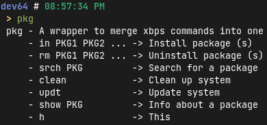

# pkg
pkg - A wrapper to merge basic (like installing, removing, searching etc) xbps commands into one, made with the help of [ari](https://ari-web.xyz/gh)

# what can it do
+ Install package (s)
+ Uninstall package (s)
+ Search for a package
+ Clean up system
+ Update system
+ Info about a package

# preview

# contributing
feel free to make fixes or add new features
